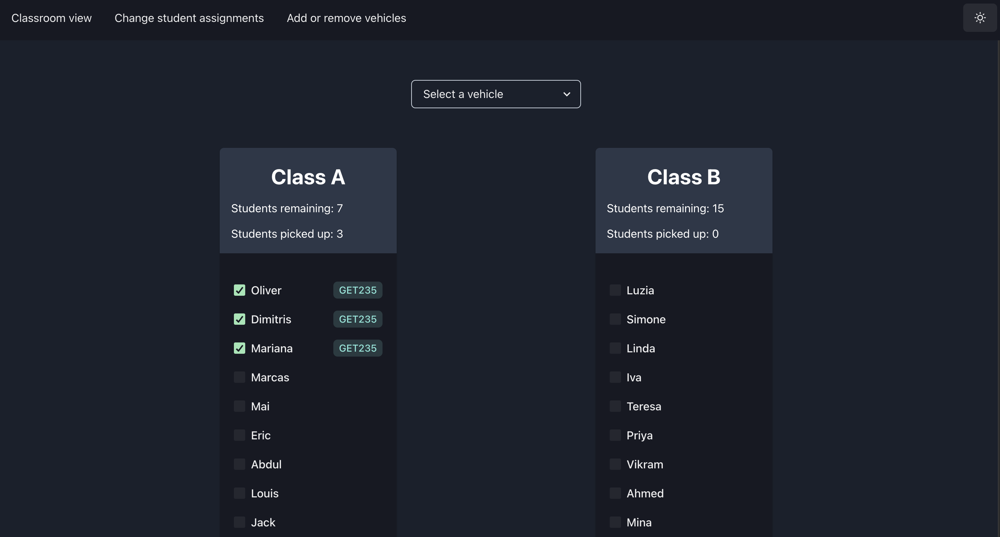

# Student Pickup App




Deployed at https://pickup-app-frontend.vercel.app/

Student pickup mini-project frontend built using Next.js framework and Chakra UI library. Backend built using AWS DynamoDB, Lambda and API Gateway (source code at https://github.com/kyzooghost/pickup-app-backend).


## Environment variables

See `.env.example` for required environment variables in `.env`


## Commands

Run development server - `npm run dev`


Build production files - `npm run build`


## Directory Structure

```text
/src - Frontend source code
  /components - Custom React components
  /constants - Constants
  /hooks - Custom React hooks
  /pages - Pages (reserved Next.js directory)
    /api - API endpoints (reserved Next.js directory)
  /styles - CSS styling
  /utils - Utility functions
/public - Static assets
```
